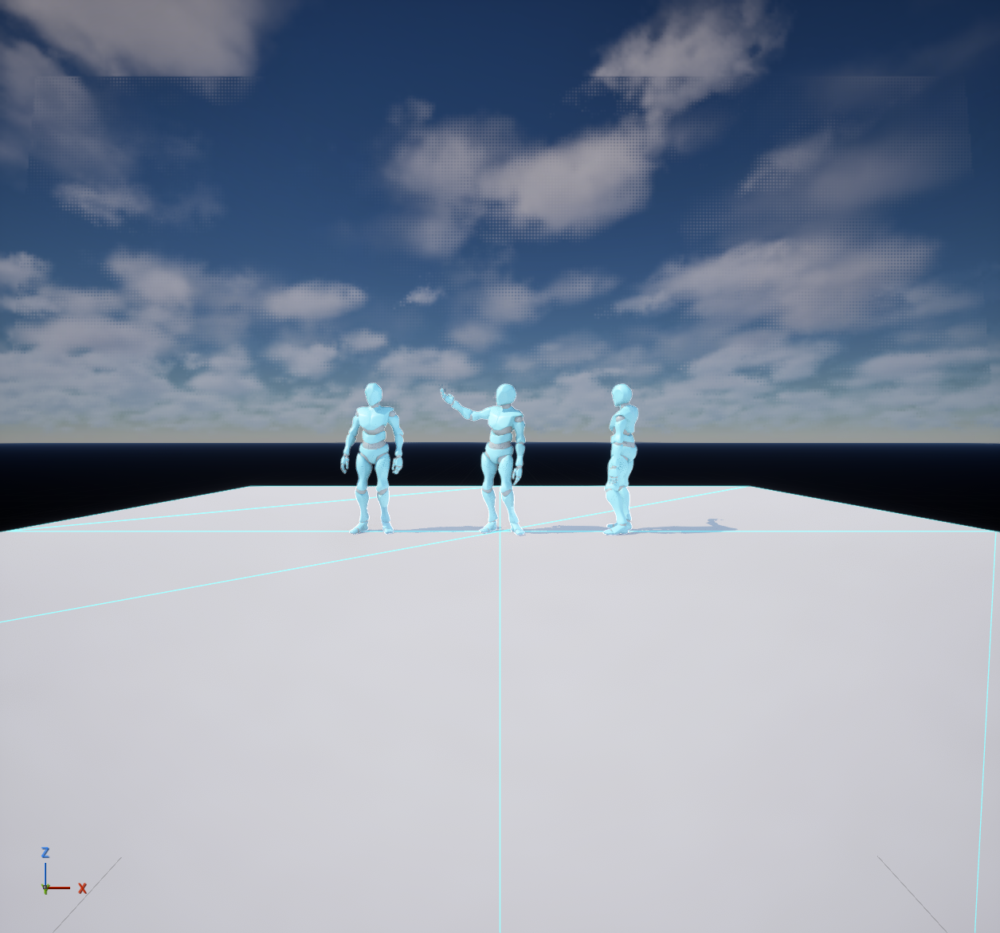
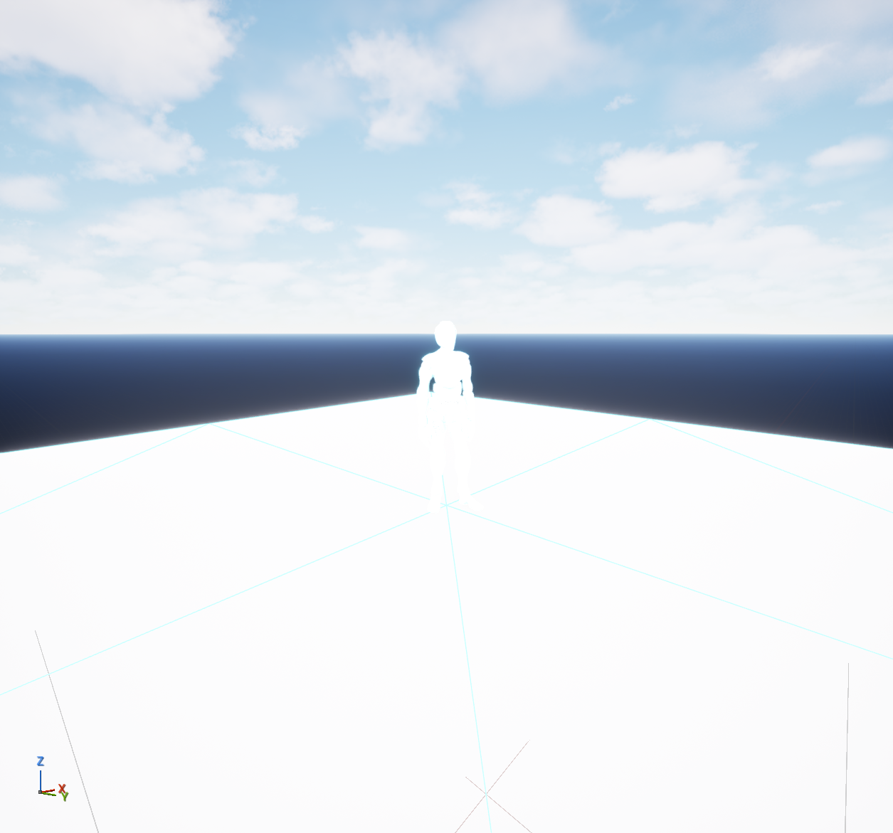
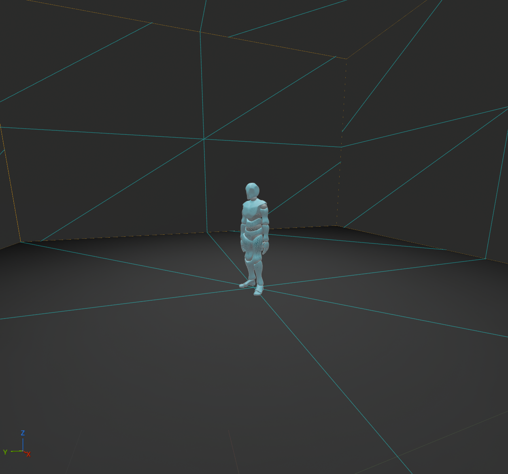
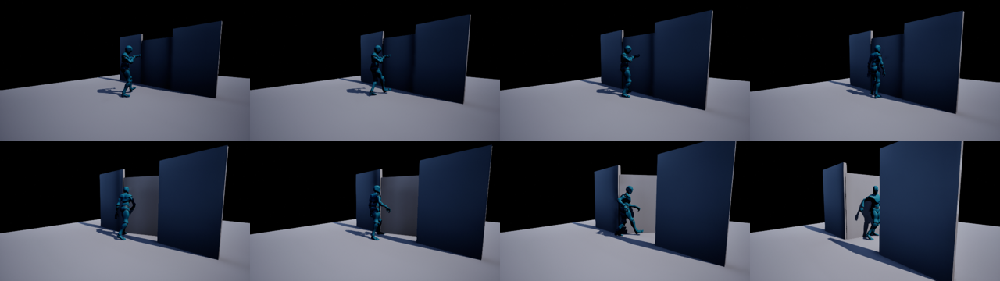

# unreal-local-director

**Turns human intent into verified actions in Unreal Engine, using a local LLM that, on its own, could not operate the engine reliably.**

This is not "an AI tool for Unreal". The model is the thin part: it reads a plain-language request and picks from a catalogue of **ready-made, measured movements and macros**. The thick part is everything around it: the tools that **measure** the result (pose, feet, bones, collisions), **refuse** what they cannot do, **restore** the scene, and **notice when the agent is stuck**. The purpose is **reference videos** (blocking, character motion, camera) for video models such as **MiniMax H3** and **LTX 2.5**, without paying a frontier model for every click.

> **v0.0.3, early and not audited.** Published so others can follow the approach and the evidence. The external audit (Codex "Astra") is the work of **v0.0.4**. Earlier snapshots: [`v0.0.1`](../../tree/v0.0.1), [`v0.0.2-wip`](../../tree/v0.0.2-wip).

### Where this is going (the important part, not built yet)

The end state is **directing, not operating**. You say what you want, in plain words, and the scene happens:

- *"Make X do this"* → the character does it: pick the motion, apply it, check the pose, show you a frame.
- *"Build a little square where X can stroll with Y"* → the agent **builds the square** (layout, ground, benches, trees, lighting, from ready-made assets), places both characters, makes them walk together without colliding, frames the camera and records the reference clip.

Today we are only at the first rung: verified standing animations on existing characters. Building places, walking paths and multi-character staging are the **future and most important part** of the roadmap.

### Why Unreal and not Blender

The aim is **intuitive and evolutive**, not pretty. Reference videos only need believable **blocking, motion and interaction**, and that means **physics**: gravity, collisions, characters bumping into furniture, objects that fall, get pushed or carried. Unreal gives this out of the box (Chaos physics, character movement, collision channels, navigation). Blender is easier and more mature to drive from an agent (its Python API is excellent, and the Blender MCP projects we learned from are ahead of anything for Unreal), but **physics and interaction between characters and objects are hard there**. We chose the harder-to-drive engine because it gets the important part right, and we are building the missing agent layer ourselves.

Frontier models (Claude Opus, GPT/Codex-class) can already operate Unreal reasonably well. They are also slow to iterate with and expensive per action. This project is the opposite bet: a **small, cheap, local model** plus **a thick layer of deterministic tools** that do the hard part, measure the result and refuse to lie.

---

## Why the official Unreal MCP is not enough (for a small local model)

Unreal 5.8 ships an official MCP server with **29 toolsets and ~593 atomic tools** (get/set properties, spawn actors, capture viewport, run editor scripts...). A frontier model can compose those. A local model could not:

| What we measured (859 real calls by our local agent) | Why it happens |
|---|---|
| **~15% of calls failed** | guessed property names (`ActorLabel` vs `actorLabel`), missing required params, the meta-tool wrapped inside itself |
| `execute_tool_script`: 503 calls, **19% errors** | the model writes editor Python on the fly, with the wrong API |
| "Done!" with the character **lying on the floor** | Unreal's bounding box does **not** follow the animated pose: a character lying down still "measures" 180 cm tall |
| Long hangs, editor modal dialogs, Play-In-Editor | one bad call blocks everything; the model has no way to know the state |

Atomic tools give the model **power without verification**. A small model needs the opposite: **few tools, each a whole task, each one measuring its own result**.

## What we built (the approach)

Borrowed from Blender agent projects (see *Credits*), re-engineered for Unreal:

| Layer | What it is | Who uses it |
|---|---|---|
| **Atomic** | the ~593 official MCP tools | only our macros, internally |
| **Macro** | one sentence = one tool: `aplicar_clipe(actor, clip)`, `medir_personagem(actor)`, `capturar_evidencia(actor)` — each reads back and **measures** | the local LLM |
| **Workflow** | bounded processes: `plateia_em_loop` (give a crowd idle/talk loops, one actor at a time, stop at first failure) | the local LLM |
| **Truth** | deterministic gates: standing, feet on the floor, actor didn't move, no neighbour collision, legs planted | every macro |
| **Vision** | second opinion on a captured frame — never approves alone | workflows |

Key pieces (all in `src/unreal_macros/`):

- **The "parallel studio"** (idea of the project owner): to measure a pose we **copy** the character into a neutral, closed grey room far from the scene, capture with and without the copy, and the pixel difference is the silhouette. A projected height ruler converts pixels to cm. The original is never touched. Studio v1 used the sky as background (cyan sky ≈ cyan mannequin, and it over-exposed); v2 is a closed **unlit grey room** with fixed exposure, and the measuring copy is painted **unlit white**:

  | v1 (sky) | v1 after editor changes | v2 (grey room) |
  |---|---|---|
  |  |  |  |

- **Gates**: `silhueta_de_pe` (160–210 cm), `pes_no_chao` (±4 cm to the real floor), `pose_em_todo_clipe` (4 instants of the clip), `pes_plantados` (leg-mask IoU: walking scores 0.0, talking 0.7–0.8), `ator_parado`, `distancia_vizinhos`, `sem_oclusao_cenario`.
- **Every failure restores** the previous state and **checks** the restore. A single lock: one operator in Unreal at a time.
- **Escape hatch** `chamada_avancada`: read-only access to the atomic tools, logged.
- **Clip library search** (`buscar_clipe`, `previa_clipe`): text search + 3-frame previews over a local Mixamo-style library (not included).
- **Contract tests** (`tests/testes_contrato.py`): 22 cases including negative controls (walking, falling, kneeling, missing roll fix, glued neighbour, forbidden saves) that **must** fail.
- **Sandbox guard** (`sandbox_guard.py`): lets an agent experiment with code changes against Unreal while refusing saves, deletes, level changes, editor scripts and any non-test actor.

Docs (Portuguese, as written during the work): `docs/pt/` — tool policy, macro list, MCP inventory, the overnight agent benchmark analysis and an external review.

## The local model: Strata + Qwen

The runtime target is **Qwen3.8-Flash-Next** (UD-IQ4_XS quant) served by **Strata** on a single 48 GB GPU machine, driven by the **Hermes** agent. In our experience it is **far better suited** to this job than the dense **Qwen3.8 27B**, which was slow and quite limited for tool-heavy Unreal work: long waits per step and many more malformed calls.

An overnight benchmark (55+ attempts, every claim cross-checked against the real tool reports) showed the local agent is **honest** (222/224 numbers it logged matched the tool output) and good at finding bugs in *our* macros — but weak at obeying "stop" / "keep going" orders. Details: `docs/pt/ANALISE_BANCADA_2026-10-06.md`.

Frontier models were used to **build and review** this scaffolding, not to run it.

## Status (honest)

Works in our lab, with measurements:
- standing gestures and talk loops on existing characters, with verified pose and feet (macros, v0.0.1);
- **chained movements in a Sequencer timeline**: stand up, walk a distance, push a door open and walk through (v0.0.3; see below);
- an in-editor Python toolset (`DirectorTools`) for what the official MCP cannot do: full actor inventory, bone positions, isolated capture of one actor.

Missing (and measured as missing): **turning toward a target**, sitting on an existing seat, picking up objects, waiting for another character, stairs. Lighting of the test captures is dark. Distance control is quantized by the walk cycle.

## v0.0.4-wip: the LLM proposes, the program measures (08/10/2026, work in progress)

The local model chooses clips and recipes; deterministic, tested code does the measuring, logging and protecting.
- **Ruler and recipe** (`src/unreal_macros/fila.py`, `receita.py`): criteria for stand up, wave, walk, stop, transitions and duration; per-step trims (`inicio_q`, `corte_fim_q`) and end turn (`turn_fim_deg`).
- **Single queue executor** (`tools/fila_executor.py`): lock, assembly, measurement, logging with the measurement conditions, cleanup and resume. An external review (Codex, read-only) found 3 holes; all fixed with tests.
- **Library** (`biblioteca/`): 138 measured clip transitions; the same transition costs the same in any recipe.
- **Break battery** (`tools/bateria.py`): lint and type check against a baseline, 16 offline suites and Hypothesis properties in a clean worktree (~40 s, all green).
- **Four work lines, one command each** (`tools/director.py`): idea scouting by the local model, the battery, the big Unreal test (a scene with variations, each with video, the operator picks one) and the external review.
- **Local dashboard** (`tools/painel.py`): run buttons, live history, score chart, videos, picking a variation, approving ideas; each run ends with a short program-built summary.

**Not proven yet:** the big Unreal test (scene with variations) has not run live; the version is not closed.

## v0.0.3: ready-made movements, verified (06/10/2026, not audited)

**Decision:** the local model does **not invent motion**. It chooses and chains **ready-made movements** whose numbers were **measured** on the clips themselves (`src/unreal_macros/blocos.py`): `andar(distance)`, `levantar()`, `abrir_porta(gap, hinge)`. The `DirectorTools` toolset builds them as a **Level Sequence** (`seq_build`), so the result renders the same way every time and becomes video.

**Vertical test ladder** (from "Marcos stands up" to "Marcos and Afonso sit and drink tea"; [gap map](docs/pt/MAPA_LACUNAS_V.md)):

| Request | Result | What was measured |
|---|---|---|
| V01 "Marcos stands up" | **5/5** | starts seated, feet never inside the seat, ends standing (hips 94 cm), toes on the floor |
| V02 "… and goes to the door" | **4/4** | 2 cm hip jump between clips, never crosses the door, stops 54 cm from it (target 60) |
| V03 "… goes to the door and opens it" | **4/4** | door opens 77°, starts moving when the **right hand** touches it, walks through, no bone inside the walls |

Videos: [walk](docs/videos/andar_sequencer.mp4) · [V01 stand up](docs/videos/V01_levantar.mp4) · [V02 stand up and go to the door](docs/videos/V02_levantar_ir_porta.mp4) · [V03 open the door](docs/videos/V03_abrir_porta.mp4) (test captures: only the listed actors are rendered, dark background).

**The door is pushed by the body, not animated by hand:** in every frame the leaf opens just enough for none of 15 bones to cross it, and never closes back (`blocos.angulos_porta`). That is how we found a real limit: the Mixamo push-door clip throws the left arm wide, so with a 100–120 cm doorway the arm went 10–15 cm into the jamb. The block now carries a **measured precondition** (gap ≥ 150 cm, hinge on the pusher's left) and **refuses** outside it, instead of producing a wrong scene.

**Run by the local model (Hermes on Strata/Qwen3.8-Flash-Next, 06/10 night):** 27 requests from a non-expert, using only the v0.0.1 production tools. Self-reported score, not yet cross-checked against the macro reports: **9 done with measurements, 17 refused with the right reason, 1 failed with a measured cause, 0 stuck**, scene restored exactly. For the refused ones it wrote plans in ready-made movements and listed what is missing; its top gap is **`virar_para` (turn toward a target)**, the silent prerequisite of walking. Raw data: [docs/pt/hermes_v003/](docs/pt/hermes_v003/).

**Also in v0.0.3:**
- `DirectorTools` (`editor_python/`): installed through `UE_PYTHONPATH`, no change to the game project; it can reload itself.
- Isolated capture **adapted from [VERA](https://github.com/ezesubu/VERA)** (MIT, credited in [THIRD_PARTY_NOTICES.md](THIRD_PARTY_NOTICES.md)).
- Pitfalls of the native UE 5.8 MCP checked live against [ue58-mcp-field-notes](https://github.com/PavelVyny/ue58-mcp-field-notes): the 20-actor cut does not happen on 5.8.3, optional arguments are required, and Sequencer poses need `force_evaluate`.

**Next, v0.0.4:**
- external audit (Codex "Astra");
- the gaps Hermes found: turn, sit on an existing seat, pick up, wait for another character;
- lighting.

## v0.0.2 (frozen: experimental base, real validation incomplete)

Theme: **the agent notices it is stuck, knows what to do, and does not waste hours.** Report ids, lock with a verifiable owner, experiment controller, stuck detector, lessons, requests bank, value queue, supervisor, session hand-off, rotation. Offline suite **137/137**; the real-Unreal validation was stopped midway and is being paid back selectively during v0.0.3 ([status](docs/pt/BLOCO5_STATUS.md), [changelog](CHANGELOG.md)).

## Requirements (if you want to try anyway)

- Unreal Engine 5.8 with the official MCP plugin listening on `http://127.0.0.1:8001/mcp`
- Python 3.11, `pip install -r requirements.txt`
- A level with Y Bot–style characters; a Mixamo-style FBX clip library (set `ULD_CLIP_LIBRARY`)
- `ULD_EVIDENCE_DIR` for captured frames
- Run the MCP server: `python src/server.py` (stdio), then point your agent (Hermes, or any MCP client) at it.
- v0.0.3 movements: install `DirectorTools` ([editor_python/LEIA.md](editor_python/LEIA.md)), then `python tools/bloco2_v.py V01|V02|V03`.

## Contributing

Issues and ideas welcome — especially: locomotion with collision gates, bone-based pose measurement, faster/stable capture, English tool names. A new macro is only accepted with **3/3 positive cases and a negative control that fails** (policy rule 11).

## Contributors

| Who | Role |
|---|---|
| **Talis** | project owner, direction, the "parallel studio" idea, lab |
| **Claude Code** (Anthropic) | implementation, tests, measurement in Unreal |
| **ChatGPT** (OpenAI) | architecture and planning reviews: the "Pedidos Atendidos" metric, the vertical test ladder, the v0.0.3 plan v2 (freeze v0.0.2, toolset first, gap-driven blocks) |
| **Codex "Astra"** (OpenAI) | external code review and audit (the v0.0.4 audit) |
| **Hermes** on **Strata / Qwen3.8-Flash-Next** | the runtime agent: runs the requests and the test benches |

AI contributors do not have GitHub accounts, so they are credited here and in [NOTICE.md](NOTICE.md) rather than in GitHub's contributor graph.

## Built on

| Project | What we use |
|---|---|
| **[ezesubu/VERA](https://github.com/ezesubu/VERA)** — Virtual Engine Reasoning Agent (MIT, © 2026 EazyLabs / maVERAick) | **code adapted**: isolated actor capture in `editor_python/director_tools/toolset.py` (from `vera/agent/tools/_capture_scripts.py`, commit `8eeb1e7`); license in [third_party/VERA/LICENSE](third_party/VERA/LICENSE) |
| **[oliver-io/unreal-harness](https://github.com/oliver-io/unreal-harness)** (MIT, © 2026 Oliver Carrillo) | ideas: gates, dry-run, closed error taxonomy, progressive disclosure, real-editor tests |

Details and the exact files: [THIRD_PARTY_NOTICES.md](THIRD_PARTY_NOTICES.md) and [NOTICE.md](NOTICE.md).

## License

Custom, source-available, **not open source** — see [LICENSE](LICENSE). This project draws on ideas from other projects and we have not yet cleared what can be fully opened.

---

### Resumo em português

**O Director transforma intenção humana em ações verificadas no Unreal, usando uma LLM local que, sozinha, não teria capacidade de operar o engine de forma confiável.** Não é uma "ferramenta de IA":
- **O modelo só escolhe:** entende o pedido e escolhe entre **movimentos prontos e medidos**.
- **O valor está em volta dele:** medir o resultado, recusar o que não sabe fazer, devolver a cena e perceber quando o agente emperrou.

O objetivo é gerar **vídeos de referência para MiniMax H3 e LTX 2.5**.

**Na v0.0.3:**
- **Escada vertical** (`docs/pt/MAPA_LACUNAS_V.md`):
  - "Marcos se levanta" 5/5;
  - "… e vai até a porta" 4/4;
  - "… e a abre" 4/4, com a porta empurrada pelo corpo e uma pré-condição medida;
  - tudo montado no Sequencer, com vídeo.
- **Hermes (Strata/Qwen) no teste de Pedidos Atendidos:** 9 atendidos, 17 recusados com o motivo certo, 1 falha justificada e 0 emperramentos. Os números são dele e ainda vão ser conferidos.

**A auditoria externa (Codex "Astra") fica para a v0.0.4.**

**Por que Unreal:** física fácil e interação entre personagens e objetos, que o Blender não tem pronta. Documentação de trabalho em `docs/pt/`.
